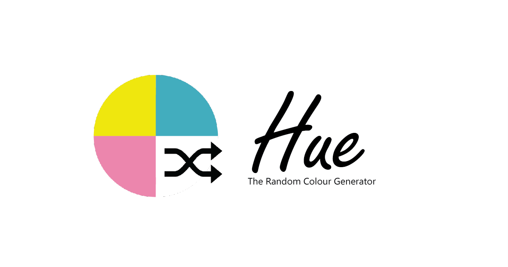
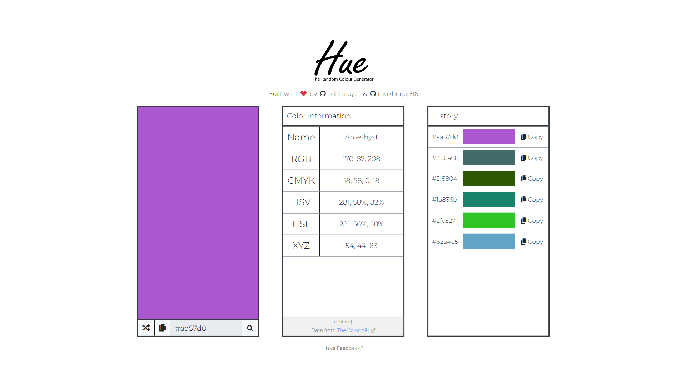

## Meet Hue - A Random Colour Generator & Format Converter
Here's a list of features:
* Displays a preview of the generated colour
* Click to copy HEX code of generated colour
* Shows each generated colour in six formats:
  * HEX
  * RGB
  * CMYK
  * HSV
  * HSL
  * XYZ
* Lets you search a color using HEX
  * Displays a preview of the color
  * Converts the HEX to all the color formats above
  * Shows name of the color
* Maintains a short history of colors generated/searched in Hue
* Progressive Web App

### Screenshot

### The Color API
**Hue generates the colors in-app, but uses [The Color API](https://www.thecolorapi.com/) for conversion to above mentioned formats.**

### Tech Stack
HTML, CSS, Bootstrap 4, Vanilla JavaScript

